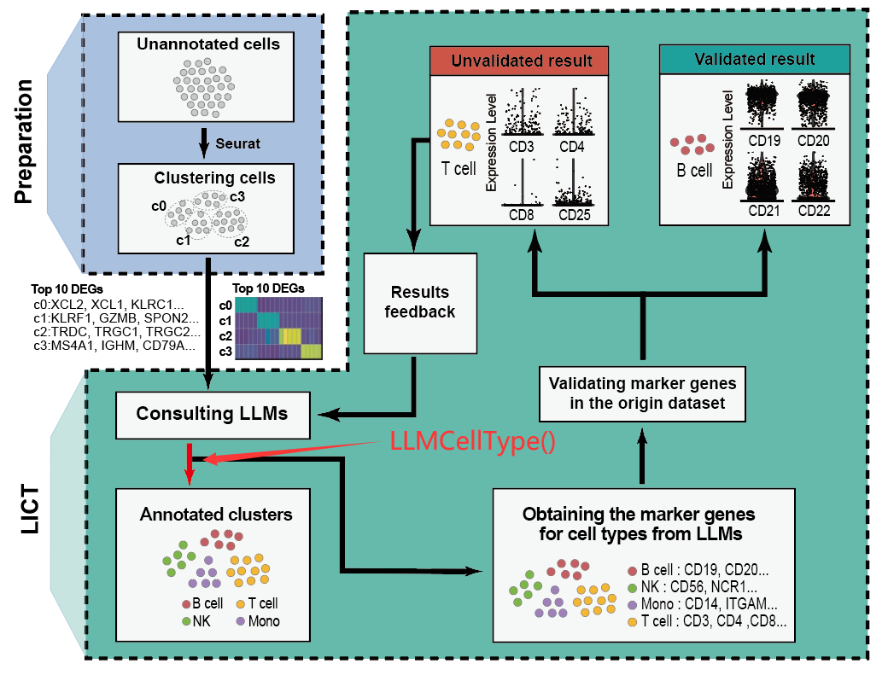
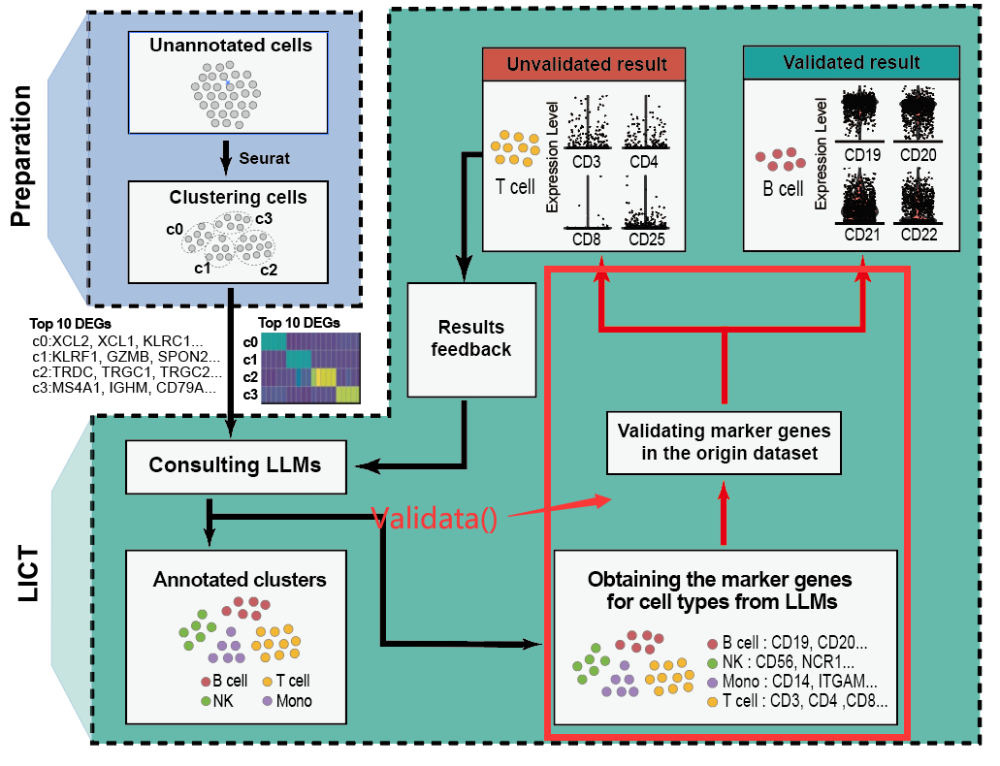
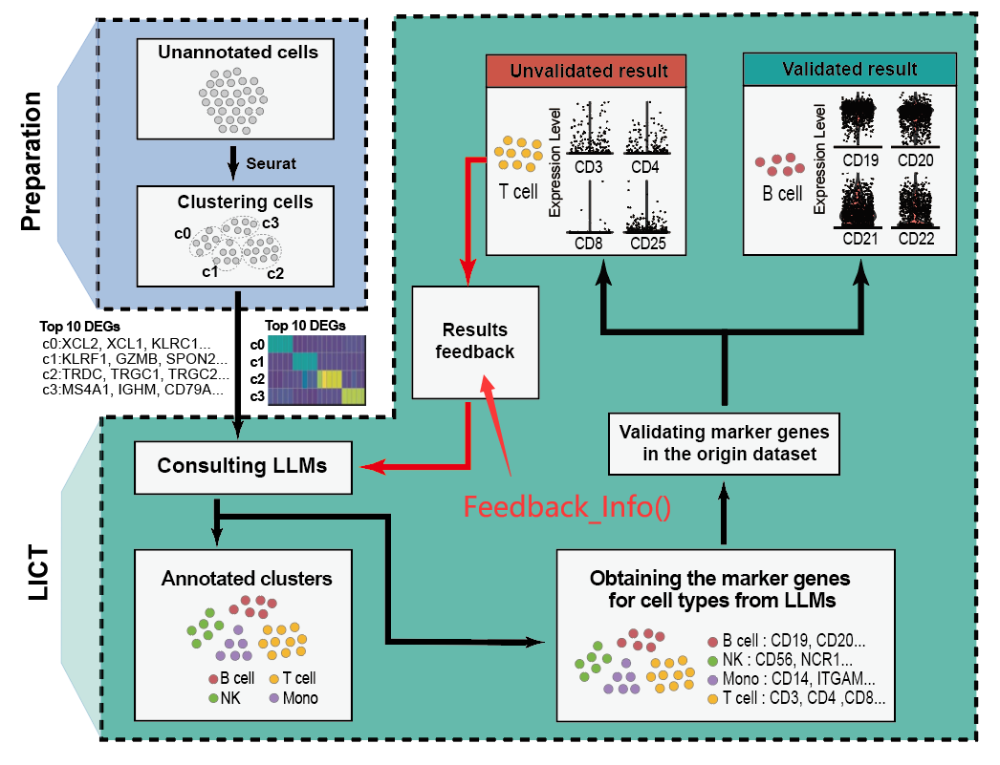

```{r setup, include=FALSE}
knitr::opts_chunk$set(echo = TRUE)
```

# **Introductions**

Reliability in cell type annotation is challenging in single-cell RNA-sequencing data analysis because both expert-driven and automated methods can be biased or constrained by their training data, especially for novel or rare cell types. Although large language models (LLMs) are useful, our evaluation found that only a few matched expert annotations due to biased data sources and inflexible training inputs. To overcome these limitations, we developed the LICT (Large language model-based Identifier for Cell Types) software package using a multi-model integration and "talk-to-machine" strategy. Tested across various single-cell RNA sequencing datasets, our approach significantly improved annotation reliability, especially in datasets with low cellular heterogeneity. Notably, we established an objective framework to assess annotation reliability using the "talk-to-machine" approach, which addresses discrepancies between our annotations and expert ones, enabling reliable evaluation even without reference data. This strategy enhances annotation credibility and sets the stage for advancing future LLM-based cell type annotation methods.

# **Installation**

LICT can be installed by following (<https://github.com/Glowworm-cell/LICT>)) on Github.

```{r eval=FALSE}

remotes::install_github("Glowworm-cell/LICT")

```

# **Preparation before using LICT**

To facilitate the use of large language models for cell annotation, the LICT framework has integrated five large language models, interacting with the models through APIs. Notably, the Llama3 70B model utilizes an API hosted on Baidu Cloud servers.

Within LLMCellIdentifier, interaction functions execute Python code in the R environment via the reticulate package (version 1.28) which is a comprehensive tool for R that enables seamless integration and interoperability between R and Python. The internal functions of the LLMCellIdentifier package automatically generate prompts that request large language models to identify cell types associated with a specified set of differential genes. These prompts are utilized to query the models via Python, which executes API calls to five major language models.

Install Python(version \>= 3.9.13) and some modules and set up the API key as a system environment variable before running LICT.

## Install Python(version \>= 3.9.13) and necessary modules

The LICT recommends using the Python version that comes with Miniconda. Users can refer to this website for installing Miniconda: <https://docs.anaconda.com/miniconda/miniconda-install/>. After installation, Python should be added to the Windows system's environment variables.

Subsequently, set the Python environment variable path within R. This method allows for the automatic retrieval of Python path:

```{r}

path <- Sys.which("python")
Sys.setenv(RETICULATE_PYTHON = path)

```

Alternatively, directly set the path to Python:

```{r eval=FALSE}

Sys.setenv(RETICULATE_PYTHON = ~\MINICONDA\python.exe)

```

Next, open python.exe within Miniconda and run the following code to install the necessary modules:

```{python eval=FALSE}

import importlib
import subprocess

def install_module(module_name):
    try:
        # Try to import the specified module
        importlib.import_module(module_name)
    except ImportError:
        # If import fails, use pip to install the module
        subprocess.check_call(["pip", "install", module_name])

# List of modules to install
modules_to_install = ["anthropic==0.25.8", "openai==0.28.1", "pathlib", "textwrap", "ipython","google-generativeai"]

# Install each module
for module in modules_to_install:
    install_module(module)

```

## Set up API key as an environment variable

To avoid the risk of exposing the API key or committing the key to browsers, users need to set up the API key as a system environment variable before running LICT.Users can obtain the API keys for ERNIE-4.0 and Llama3 70B from <https://console.bce.baidu.com/qianfan/ais/console/applicationConsole/application/v1>, <br>for Claude 3 opus from <https://console.anthropic.com/settings/keys>, <br>for ChatGPT-4 from <https://platform.openai.com/api-keys>, <br>for Gemini1.5 pro from <https://aistudio.google.com/app/apikey>.

Set up the API key as a system environment variable before running LICT.It is not mandatory to fill in the API keys for all five major language models here; entering keys for one or more is sufficient for operation. The analysis will be conducted using the large language models corresponding to the API keys entered.Please delete the code for any large language models that are not in use.

```{r}
####loading package
library(reticulate)
library(dplyr)
library(scales)
library(Seurat)
#### Retrieve the API key from the environment variables in the Windows operating system.
reticulate::py_run_string("
import os
import openai
ERNIE_api_key = os.getenv('ERNIE_api_key')
ERNIE_secret_key = os.getenv('ERNIE_secret_key')
GEMINI_api_key = os.getenv('GEMINI_api_key')
openai.api_key = os.getenv('openai_api_key')
Llama3_api_key = os.getenv('Llama3_api_key')
Llama3_secret_key = os.getenv('Llama3_secret_key')
ANTHROPIC_API_KEY = os.getenv('ANTHROPIC_API_KEY')
")
####Here, we have pre-configured the API key in the Windows environment variables.
```

Alternatively, you can execute the following to set a temporary environment variable for running LICT:

```{r eval=FALSE}
####Replace it with your API key and secret_key
Sys.setenv(Llama3_api_key = 'Replace_your_key')
Sys.setenv(Llama3_secret_key = 'Replace_your_key')
Sys.setenv(ERNIE_api_key = 'Replace_your_key')
Sys.setenv(ERNIE_secret_key = 'Replace_your_key')
Sys.setenv(GEMINI_api_key = 'Replace_your_key')
Sys.setenv(openai.api_key = 'Replace_your_key')
Sys.setenv(ANTHROPIC_API_KEY = "Replace_your_key")
reticulate::py_run_string("
import os
import openai
ERNIE_api_key = os.environ['ERNIE_api_key']
ERNIE_secret_key = os.environ['ERNIE_secret_key']
GEMINI_api_key = os.environ['GEMINI_api_key']
openai.api_key = os.environ['openai.api_key']
Llama3_api_key = os.environ['Llama3_api_key']
Llama3_secret_key = os.environ['Llama3_secret_key']
ANTHROPIC_API_KEY = os.environ['ANTHROPIC_API_KEY']
")
```

# **Run LICT**

In this tutorial, we will analyze an gastric tumor data set available at <http://ncbi.nlm.nih.gov/geo/query/acc.cgi?acc=GSE206785>. The data, processed and packaged into a Seurat object, can be accessed [here](https://figshare.com/s/ec1c0c2104688ab51c3d).This dataset comprises 2000 single cells which randomly subset from the gastric tumor data set.

## Seurat Data processing

Single cell data with cluster information is required for downstream analysis, user can follow the instruction listed at [here](%5BAnalysis,%20visualization,%20and%20integration%20of%20Visium%20HD%20spatial%20datasets%20with%20Seurat%20•%20Seurat%20(satijalab.org)%5D(https://satijalab.org/seurat/articles/pbmc3k_tutorial)), here we use a gastric tumor dataset with cell cluster info as example:

```{r message=FALSE}
####loading gastric tumor dataset
seurat_obj = readRDS('../../gc.rds')
seurat_obj = FindVariableFeatures(seurat_obj, selection.method = "vst", nfeatures = 2000)
seurat_obj = NormalizeData(seurat_obj)
seurat_obj = ScaleData(seurat_obj)
seurat_obj = RunPCA(seurat_obj, features = VariableFeatures(object = seurat_obj))
seurat_obj = FindNeighbors(seurat_obj, dims = 1:10)
###we recommend partitioning the data into clusters consisting of no more than 15 items each. Should the number of clusters exceed 15, we advise using the subset() to further divide the data, following the FindCluster() operation, into several Seurat objects, each containing fewer than 15 clusters, before proceeding with cell type annotation using LICT.
seurat_obj = FindClusters(seurat_obj, resolution = 0.6)
###check current object has annotation
unique(Idents(seurat_obj))
```

make sure that the seurat_obj has character or numeric annotation

```{r message=FALSE}
####running Seurat workflow
markers <- FindAllMarkers(object = seurat_obj, only.pos = T, min.pct = 0.25, logfc.threshold = 0.25)
```

## Direct LLMs for cell type annotation

We use LLMCellType() function to simultaneously direct all large language models for cell type annotations analysis.



```{r}
####loading package
library(LICT)
####input FindAllMarkers() function result, species, top gene number, and tissuename
LLMCelltype_res = LLMCellType(FindAllMarkersResult = markers,
                             species = 'human',
                             topgenenumber = 10,
                             tissuename = 'gastric tumor')
```

The result of each LLMs will be stored at a list, with name:ERNIE,Gemini,GPT,Llama,Claude, respectively, users could access these result with their names, e.g. LLMCelltype_res\$ERNIE

```{r}
rownames(LLMCelltype_res$ERNIE) = seq(1,nrow(LLMCelltype_res$ERNIE))
head(LLMCelltype_res$ERNIE)
```

Or alternatively, users can invoke different large language models to analyze data by individually utilizing `GPTCellType()`, `Llama3CellType()`, `ERNIECellType()`, `ClaudeCellType()`, and `GeminiCellType()`

## Evaluation of LLM's cell annotation results

To check whether LLMs rendered reliable results, we can use the Validate() function to evaluate the results. Three parameters were needed: <br>1 The LLM_res parameter, the results generated from the LLMCelltype();<br> 2 Previously loaded Seurat object;<br> 3 The threshold for defining positive genes. Here, we will use 0.6 as the threshold, as stated in the article.That mean cell type annotations with four or more positive marker genes (expressed in over 60% of cells) are considered validated.



```{r}
####input LLMCelltype() function result, seurat_obj, and Percent
Validate_res = Validate(LLM_res = LLMCelltype_res, seurat_obj = seurat_obj, Percent = 0.6)
```

Validate() will automatically calculated and labeled each input gene with positive_marker or negative_marker, each LLMs results will gathered and stored in a list, users could access these values with LLMs name(ERNIE,Gemini,GPT,Llama,Claude), for example for ERNIE validation result:

```{r}
head(Validate_res$ERNIE[,c(1,2,4,5)])
```

## Calculating the reliability of LLMs annotation results

Cell type annotations with four or more positive marker genes (expressed in over 60% of cells) are considered reliable. The column "Total reliable" refers to the annotation results of LICT cells being considered 'reliable' if more than one among the five types of LLMs cell type annotation is 'reliable'.

```{r}
Reliable_Df = Reliable_Df(Validate_res)
Reliable_Df$Clusters = seq(0,nrow(Reliable_Df)-1)
Reliable_Df = Reliable_Df[,c(7,1:6)]
Reliable_Df
```

## Talk-to-machine

If most of cell annotation failed to be reliable, LICT would apply another strategy 'talk-to-machine' to refine LLM's response. Both positive gene and negative gene marker together with additional differential expressed gene in the original datasets will provide to each LLMs and request cell annotation update. This strategy can simply achieve through `Feedback_Info()`. Users need to provide: <br>1. validation result from Validate(),<br>2.Differential expression gene table generated from Seurat::FindAllMarkers()



```{r}
Validate_Result_to_Df = Validate_Result_to_Df(Validate_res)
####input Validate_Result_to_Df() result and you want to put top how many FindAllMarkers() result next top DEGs to LLMs. Here we use top 11 to 20 DEGs.
interacted_res = Feedback_Info(Validate_Result_to_Df, 11, 20, markers)
```

Feedback_Info() will automatically feedback information to LLMs and try to request each LLM to update their cell type annotation, each LLMs results will gathered and stored in a list, users could access these values with LLMs name(ERNIE,Gemini,GPT,Llama,Claude), for example for ERNIE validation result:

```{r}
rownames(interacted_res$ERNIE) = seq(1,nrow(interacted_res$ERNIE))
head(interacted_res$ERNIE)
```

If users already have a desired marker gene list, they can manually input `positive_gene` and `negative_gene` for feedback interaction via `LLM_interact()`, as following format, or substitute the gene symbol in the quote with their desired genes.

```{r eval=FALSE}
inter_res = LLM_interect(positive_gene = list(
  cluster0 = c(strsplit(c('PMP22,RGS2,COL3A1,CYP27A1,EMP2,BMPER,VIM,SNAI2,KRT8,SLC9A3R1,KRT18,ITGB1,HAND1'),',')),
  cluster1 = c(),
  cluster2 = c(strsplit(c('MSX2,HERPUD1,TPM1,GLB1,ABCG2,KRT18,KRT7,TMEM54,DSP,DLX5,TFAP2A'),',')),
  cluster3 = c(strsplit(c('CAST,OTX2,CRABP2,PLK2,SFRP1,RIPPLY1,ACSS3,HSP90B1,ROR1,LRRTM1'),',')),
  cluster4 = c(strsplit(c('RBP4,APOA4,AGT,SERPINA1,FLRT3,CCKBR,IGFBP6,FGA,GPC3,APOE5,APOA1,APOA2'),',')),
  cluster5 = c(),
  cluster6 = c(),
  cluster7 = c(strsplit(c('THBS1,LCP1,PECAM1,AIF1,HLA.E,GPX1,B2M,MEF2C,S100A4,CCL3'),',')),
  cluster8 = c(strsplit(c('KCNK17,LINC01356,RSPO3,ABLIM1,TBXT,TMSB15A,CKS1B,PPIAP46,HMGB3,HVCN1'),',')),
  cluster9 = c(strsplit(c('SCG3,POU5F1,TBXT,L1TD1,FABP5,EFEMP1,ATP5PD,TSTD1,UCHL1,PTPRZ1,DPPA4,KRT18,ITGB1'),',')),
  cluster10 = c()
  ),
  negative_gene = list(
    cluster0 = c(strsplit(c('TBX5,MEF2C,GATA4,TNNI3,TNNT2,MYL7,ACTC1,HCN4,NPPA,SIRPA,CXCR4,PDGFRA,GATA3,KRT7,ELF5,ITGA6,SDC1,SDC4,TEAD4'),',')),
    cluster1 = c(),
    cluster2 = c(strsplit(c('PAX3,SNAI2,TWIST1,SOX9,MITF,KIT,ZIC1,DLX2,MSX1,ERG,PECAM1,CD34,KDR,CLDN5,FLT1,TEK,RAMP2,ENG,NRP1,THBD,ADGRL4'),',')),
    cluster0 = c(strsplit(c('TBXT,MIXL1,EOMES,GSC,WNT3A,CHRD,TDGF1,MKX,FOXH1,CER1,LEFTY1,SHH,FOXA2,HESX1,OTX2'),',')),
    cluster0 = c(strsplit(c('ALB,TTR,AFP,HNF4A,CYP2E1,G6PC,HAMP,ASGR1,TBX3,FABP1,GATA6,LHX1,OTX2,SOX17,FOXA2,CER1,DAB2,PDGFRA,TFAP2A,HNF1B,TAT,HMGCS2,SERPINA1'),',')),
    cluster0 = c(),
    cluster0 = c(),
    cluster0 = c(strsplit(c('GP9,PF4,THBS1,MPL,VWF,CD36,JAK2,RUNX1,ITGA2B,PPBP,F2R,GP1BA'),',')),
    cluster0 = c(strsplit(c('NOG,FOXA2,NOTO,CDX2,WNT3A,FGF8,LHX1,ACVR1,TBXT,MESP1,EOMES,MIXL1,PDGFRA,BMP4,CER1,LEFTY1,NODAL'),',')),
    cluster0 = c(strsplit(c('NANOG,SOX2,FGF5,KLF4,ZFP42,TDGF1,TERT,SALL4,KLF2,MYC,GATA3,KRT7,CGA,SDC1,SDC4,HAND1,TEAD4,ITGA6,ELF5,FN1,COL1A1,COL1A2,COL3A1,THY1,VIM,PDPN,ACTA2,PDGFRB,S100A4,MMP2,MMP9'),',')),
    cluster0 = c()
    ))
```

## Evaluation of LLM's cell annotation results with **feedback**

```{r}
feedback_Validate = Validate(LLM_res = interacted_res, seurat_obj = seurat_obj, Percent = 0.6)
```

Users could also access these values with LLMs name(ERNIE,Gemini,GPT,Llama,Claude), for example for ERNIE validation result:

```{r}
head(feedback_Validate$ERNIE[,c(1,2,4,5)])
```

To fullly leaverage both result, users could use following function to obtain optimal result

```{r}
Feedback_Reliable_Df = Reliable_Df(feedback_Validate)
Feedback_Reliable_Df$Clusters = seq(0,nrow(Feedback_Reliable_Df)-1)
Feedback_Reliable_Df = Feedback_Reliable_Df[,c(7,1:6)]
intersect_res = intersect_result(Reliable_Df,Feedback_Reliable_Df)
intersect_res
```

## Evaluation of manual cell annotation

Users can also create a list in the following format containing manual cell type annotations, which can then be inputted into the `Validate()`for evaluation. The row number is the factor level of the annotations.

```{r}
###Type is manual annotation in metadata
Idents(seurat_obj) = factor(seurat_obj@meta.data$Type)
manual_annotation = list(manual = data.frame(row = c(1:length(levels(Idents(seurat_obj)))), cell_type = levels(Idents(seurat_obj))))
Validate_manual = Validate(LLM_res = manual_annotation, seurat_obj = seurat_obj, Percent = 0.6)
```

Calculating the reliability of manual annotation results

```{r}
df = Validate_manual$manual[,3]
for(i in 1:length(df)){
  n = unlist(strsplit(df[i],','))
  if(length(n)>=4){
    Validate_manual$manual$reliable[i] = 'YES'
  }else{
    Validate_manual$manual$reliable[i] = 'NO'
  }
}
Validate_manual$manual
```
